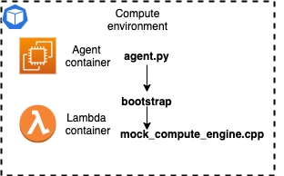

# Development

This section outlines how to approach the operations and development of the HTC Grid.



HTC-Grid comes with a mock execution engine mock_compute_engine.cpp. This is the executable that is invoked for every submitted task. In real deployments this executable will need to be replaced with a real implementation. Steps below outline how to modify and apply changes to the custom execution code.

## Building Lambda layer

In order to apply changes of the lambda layer, you need to build lambda layer container and execute it locally.

* Go to src_client folder. This folder contains all the files necessary for building lambda layer.
* Build the docker image, note the ID of the created container.
    ```
    docker build -f Dockerfile.Build -t build_lambda .
    ```
* Push the newly built layer by executing docker run
    ```
    docker run --rm -v ~/.aws/config:/root/.aws/config -e LAYER_NAME="mock-computation-cpp" build_lambda:latest

    #example:
    docker run --rm -v ~/.aws/config:/root/.aws/config 7379d2acd853
    ```

* If required update EKS deployment as new images need to be deployed.