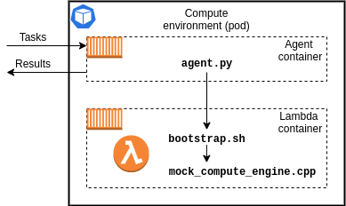

# Development

This section outlines how to develop and deploy a custom application on HTC-Grid.

At the top level, there are 3 main components that need to be developed:

1. A **client application(s)** that will interact with a deployment of HTC-Grid by submitting tasks and retrieving results.
2. A **worker (lambda) function** that will be receiving and executing tasks.
3. **Configuration of the HTC-Grid's deployment process** to incorporate all the relevant changes (specifically for the backend worker functions).


## 1. Developing a Client Application

HTC-Grid implements Python3 API (please refer to [API Reference](docs/reference.md) for more details) and provides several client application examples of how to use the API (see `client.py`, `cancel_tasks.py`, and `portfolio_pricing_client.py`  examples in `/examples/client/python`).

These examples show how to:
- Connect to an HTC-Grid deployment
- Authenticate the client
- Submit multiple tasks
- Wait for the results
- Retrieve results

Follow these examples to write a custom applications.

```Python

from api.connector import AWSConnector

import os
import json
import logging

client_config_file = os.environ['AGENT_CONFIG_FILE']

with open(client_config_file, 'r') as file:
    client_config_file = json.loads(file.read())


if __name__ == "__main__":

    logging.info("Simple Client")
    gridConnector = AWSConnector()

    gridConnector.init(client_config_file, username=username, password=password)
    gridConnector.authenticate()

    task_1_definition = {
        "worker_arguments": ["1000", "1", "1"]
    }

    task_2_definition = {
        "worker_arguments": ["2000", "1", "1"]
    }

    submission_resp = gridConnector.send([task_1_definition, task_2_definition])
    logging.info(submission_resp)


    results = gridConnector.get_results(submission_resp, timeout_sec=100)
    logging.info(results)
```

Current release of HTC-Grid includes only Python3 API. However, if required, it is possible to develop a custom API using different languages (e.g., Java, .Net, etc.). Existing API is very concise and relies on the AWS API to interact with AWS services (refer to./source/client/python/api-v0.1/api for the example).

## Running a Client Application
### Running a Client Application as a pod on EKS

This is the easiest way to deploy a client application for testing purposes. Overview:
1. A client application is being packaged locally into a container.
2. The container is being deployed on the same EKS cluster governed by HTC-Grid as Job.
3. Once container is deployed, it launches the client application that submits the tasks.

#####
Details:
1. **Build and Push docker image** Build an image that will have all dependencies to be able to execute the client. See example in `examples/submissions/k8s_jobs/Dockerfile.Submitter`.
 In the example below we copy client.py into a container and install all dependencies form the requirements.txt.

    ```Docker
    FROM python:3.7.7-slim-buster

    RUN mkdir -p /app/py_connector
    RUN mkdir -p /dist

    COPY ./dist/* /dist/
    COPY ./examples/client/python/requirements.txt /app/py_connector/

    WORKDIR /app/py_connector

    RUN pip install -r requirements.txt

    COPY ./examples/client/python/client.py .
    ```

    Push the image into the registry

    ```Makefile
    SUBMITTER_IMAGE_NAME=submitter
    TAG=<the tag specified during the HTC-Grid deployment>
    DOCKER_REGISTRY=$(ACCOUNT_ID).dkr.ecr.$(REGION).amazonaws.com

    docker push $(DOCKER_REGISTRY)/$(SUBMITTER_IMAGE_NAME):$(TAG)
    ```
2. Create a deployment .yaml file. For example:

    ```yaml
    apiVersion: batch/v1
    kind: Job
    metadata:
    name: single-task
    spec:
    template:
        spec:
        containers:
        - name: generator
            securityContext:
                {}
            image: XXXXXX.dkr.ecr.eu-west-1.amazonaws.com/submitter:XXXX
            imagePullPolicy: Always
            resources:
                limits:
                cpu: 100m
                memory: 128Mi
                requests:
                cpu: 100m
                memory: 128Mi
            command: ["python3","./simple_client.py", "-n", "1",  "--worker_arguments", "1000 1 1","--job_size","1","--job_batch_size","1","--log","warning"]
            volumeMounts:
            - name: agent-config-volume
                mountPath: /etc/agent
            env:
            - name: INTRA_VPC
                value: "1"
        restartPolicy: Never
        nodeSelector:
            grid/type: Operator
        tolerations:
        - effect: NoSchedule
            key: grid/type
            operator: Equal
            value: Operator
        volumes:
            - name: agent-config-volume
            configMap:
                name: agent-configmap
    backoffLimit: 0
    ```

    For the examples provided with HTC-Grid, these .yaml files are generated automatically when `make happy-path` command is executed. Each .yaml file is a template (e.g., examples/submissions/k8s_jobs/single-task-test.yaml.tpl) that is being filled in with relevant fields that match the AWS account and deployment configuration. The substitution is done by examples/submissions/k8s_jobs/Makefile and relevant attributes are passed in by the ./Makefile.

    Note, once docker image is built and pushed into registry, the yaml file contains the ``command`` parameter that tells how to launch the client application once container is running.

    The deployment yaml file can be generated by extending existing build process, written manually, or generated in any other way that suited the workload.

3. To launch the client, simply execute the following command.

    ```Bash
    kubectl apply -f ./generated/<custom.yaml.file>.yaml
    ```


### Running a Client Application locally

<TODO>

## 2. Developing a Worker Function


HTC-Grid uses Amazon Elastic Kubernetes Service (Amazon EKS) as a computational backend. Each engine is a pod running two containers: (i) an Agent and a (ii) Worker Function.

- The **Agent** provides a connectivity layer between the HTC-Grid and the Worker container. Agent's responsibilities include: (i) pulling for new tasks, (ii) interacting with the Data Plane (I/O), (iii) sending heartbeats back to Control Plane, and (iv) indicating completion of a task. Note, Agent does not need to be changed when developing new applications on HTC-Grid.
- The **Worker container** executes the custom code that performs the computational task. The execution is done locally within the container. The code of the worker function needs to be modified during the development.
    - Note: depending on the workload it is possible for the Worker function to access HTC-Grid's Data Plane directly or to access any other external systems as might be required. This functionality is not provided as part of the HTC-Grid.

At the high level the development process involves 4 steps:

1. Write a custom Worker code for the target workload.
2. Package all the dependencies into a docker container which also includes custom Lambda runtime that will be used to execute worker function.
3. Use this container to compile & test your code
4. Zip the compiled function along with any dependencies and upload to an S3 bucket (default bucket name is stored in $S3_LAMBDA_HTCGRID_BUCKET_NAME)
    1. (if S3 bucket is different from $S3_LAMBDA_HTCGRID_BUCKET_NAME) Update HTC-Grid configuration to point to the new location of the target Zip file.


## Developing Python3 Worker Function

HTC-Grid comes with examples demonstrating how to build Python3 and C++ based Worker functions.
The diagram below outlines the relationship between the Agent and the Worker function following Python3 example.


HTC-Grid's Worker function follows the same API as AWS Lambda function.
Following examples supplied with HTC-Grid (``examples/workloads/python/mock_computation/mock_compute_engine.py`` and ``examples/workloads/python/quant_lib/portfolio_pricing_engine.py``) and [AWS Lambda documentation](https://docs.aws.amazon.com/lambda/latest/dg/python-handler.html) write a python module that implements a lambda_handler entry point. This is the function that will be invoked when Agent passes the task to the Worker function.

Note, the entry python file and the handler function name can be re-defined in ``generated/python_runtime_grid_config.json`` (see below). To apply these changes, ``terraform apply`` needs to be re-executed under ``deployment/grid/terraform``

```JSON
"agent_configuration": {
    "lambda": {
       ...
      "lambda_handler_file_name" : "portfolio_pricing_engine",
      "lambda_handler_function_name" : "lambda_handler"
    }
  }
```


The ``lambda_handler`` has two arguments an ``event`` and a ``context``.
- ``event`` - is the task's definition that was provided by the client application at the time of the task submission.
- ``context`` -[To be defined]

The return of the ``lambda_handler`` function will be treated as the result of the task's execution and will be stored in the Data Plane by the Agent. Subsequently, the Client application will be able to retrieve this output from the Data Plane.

### Python3 Including Dependencies

HTC-Grid uses custom Lambda runtime [docker-lambda](https://hub.docker.com/r/lambci/lambda/) which closely mimics the runtime of AWS Lambda. Custom Lambda runtime (along with any additional dependencies) should be included into the docker image to execute the Worker function. See example below:

``` Dockerfile
# 1. Include custom lambda runtime
FROM lambci/lambda:build-python3.8

# 2. Create a directory which will hold all relevant dependencies e.g., [/app]
RUN mkdir -p /app
WORKDIR /app

# 3. Copy all relevant local dependencies
COPY portfolio_pricing_engine.py .
COPY american_options.py .
COPY european_options.py .
COPY ql_common.py .

# 4. Install any third party dependencies into the [/app] folder
RUN pip install --target=/app QuantLib

# 5. Zip the content of the [/app] which holds all the dependencies at this stage
RUN mkdir -p /app/build
RUN zip -yr lambda.zip .
CMD cp lambda.zip /app/build
```

The content of the produced zip file should be copied into an S3 bucket. The name of the bucket is stored in S3_LAMBDA_HTCGRID_BUCKET_NAME environmental variable which is set during the deployment stage of the HTC-Grid allowing the grid to retrieve and deploy the correct Worker function package at runtime.

For the complete examples please refer to one of the Makefiles in ``examples/workloads`` directory.

## Developing C++ Worker Function

Writing a C++ Worker Function requires creation of an additional shell script: ``bootstrap``. The bootstrap script is a simple wrapper that takes inputs from Agent and passes it to the C++ executable, similarly it takes the response and passes it back to the Agent once task is done. See example below:



An example of a complete ``bootstrap`` can be found here: ``examples/workloads/c++/mock_computation/bootstrap``, although, a custom version of the bootstrap script will be required for the custom Worker function.

- The bootstrap script takes task's definition as a string and passes them to the executable as an argument.
- C++ executable does not need to have a lambda_handler method implemented, instead, the execution starts at the ``main`` method.


### C++ Including Dependencies

Packaging all dependencies and uploading them to an S3 bucket is generally the same as for the Python3 runtime. However, C++ requires an additional step of compiling the source code before zipping all the dependencies. Compiling all the dependencies in the container guarantees that the executable will run in the provided runtime once deployed in HTC-Grid. Refer to a complete example here: ``examples/workloads/c++/mock_computation/Dockerfile.Build``

```Dockerfile
# Snippet example:
...

COPY mock_compute_engine.cpp .

COPY Makefile .  #Compile the executable in the runtime environment.

RUN make main
...
```

## 3. Configuring HTC-Grid Deployment

- There are no additional changes required to HTC-Grid to define/launch new Client applications.
- Some changes might be required to update Worker functions, see below

The root ./Makefile  has 3 options for building and uploading sample Worker functions (e.g., ``upload-c++``, ``upload-python``, and ``upload-python-ql``). These options simply automate all steps described in Section 2 "Developing a Worker Function". Follow these examples to build & upload custom worker function code. To execute each option in isolation, specify the option with the make (i.e., instead of happy-path).

```bash
make upload-c++ TAG=$TAG ACCOUNT_ID=$HTCGRID_ACCOUNT_ID REGION=$HTCGRID_REGION BUCKET_NAME=$S3_LAMBDA_HTCGRID_BUCKET_NAME
```

The above steps will upload new Worker Function zip in S3 bucket. However, only new worker pods will be able to benefit from this update. To apply the changes to the entire deployment it is necessary to remove all currently running worker pods (e.g., by executing ``kubectl delete $(kubectl get po -o name)``).

Each compute environment pod starts by executing lambda-init container (defined at ``source/compute_plane/shell/attach-layer``) which pulls the Worker function zip package from the S3_LAMBDA_HTCGRID_BUCKET_NAME S3 bucket at the pod boot time.


