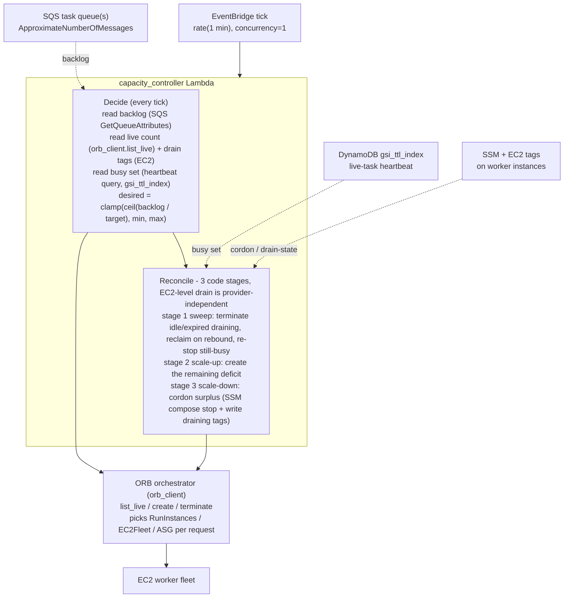

# HTC-Grid EC2 Backend - Graceful Scale-Down Sequence

How `worker_backend = "ec2"` scales **down** without breaking running tasks (ADR-003, ADR-005).
Scale-down is a two-phase **cordon then sweep then terminate** loop driven by the capacity
controller. It is task-aware: an instance is only terminated once it has no in-flight work (or its
drain deadline passes). This is the EC2 analogue of draining a node before the Cluster Autoscaler
removes it on EKS.

The drain is **provider-independent** (ADR-005): cordon, idle-detection, and drain-state are
**EC2-level functions owned by the controller** (SSM `compose stop`, the task heartbeat, EC2 tags),
so they work no matter how capacity was provisioned. The controller asks **ORB** only to
list / create / terminate; ORB owns the AWS API choice (RunInstances / EC2Fleet / ASG, possibly
different per request). The "busy" signal is the **existing task heartbeat** - the same
`gsi_ttl_index` the `ttl_checker` queries, but for live (not expired) tasks. No new index, no new
table, no agent change. See `docs/architecture_design_decisions.md` and the up/down overview in
[`ec2-scaling-up-sequence.md`](ec2-scaling-up-sequence.md).

## Controller structure (two stages)



The drain core (the cordon in scale-down plus the sweep) is EC2-level and provider-agnostic: it
cordons and waits for idle, then tells ORB to terminate the idle ids. ORB owns the **API choice** (RunInstances / EC2Fleet / ASG,
possibly different per request) and decrements the right request on terminate - so the **graceful**
logic is universal and only the **kill** is API-specific, handled inside ORB.

## Cordon (a surplus tick - the controller drains directly)

```mermaid
sequenceDiagram
    autonumber
    box rgb(225,245,254) Trigger
        participant EB as EventBridge<br/>rate(1 min)
    end
    box rgb(232,245,233) Scaling control (controller owns drain)
        participant CTL as capacity_controller<br/>Lambda (concurrency=1)
        participant SQSQ as SQS task queue(s)
        participant DDB as DynamoDB state<br/>gsi_ttl_index
    end
    box rgb(255,243,224) ORB
        participant ORB as orb_orchestrator<br/>Lambda
    end
    box rgb(252,228,236) Worker plane
        participant EC2 as EC2 worker instance
        participant SSM as SSM
    end

    EB->>CTL: invoke tick
    CTL->>SQSQ: GetQueueAttributes (ApproximateNumberOfMessages)
    SQSQ-->>CTL: backlog
    CTL->>ORB: list_live
    ORB-->>CTL: live machines (id, created_at)
    CTL->>EC2: DescribeInstances (read htc lifecycle / drain_deadline tags)
    EC2-->>CTL: drain state per instance
    CTL->>DDB: query live tasks (processing AND heartbeat in future)
    DDB-->>CTL: task_owner per live task, mapped to busy instance set
    Note over CTL: busy set read every tick (sweep needs it too);<br/>None if state table throttling
    Note over CTL: desired = clamp(ceil(backlog / target), min, max)<br/>active = live minus draining

    alt desired < active  (surplus, pick victims)
        Note over CTL: victims = active minus desired, idle first then oldest
        CTL->>EC2: CreateTags lifecycle=draining, drain_deadline
        CTL->>SSM: SendCommand docker compose stop
        SSM->>EC2: SIGTERM agents (caught ~64ms, drain in ~10s) - RIE ignores SIGTERM, rides stop_grace_period
        Note over CTL: returns now, no blocking - send_command is fire-and-forget,<br/>terminate happens on a later tick gated on the worker going idle
    end
```

## Sweep (a later tick - terminate drained, reclaim if backlog rebounds)

```mermaid
sequenceDiagram
    autonumber
    box rgb(232,245,233) Scaling control
        participant CTL as capacity_controller
        participant SQSQ as SQS task queue(s)
        participant DDB as DynamoDB gsi_ttl_index
    end
    box rgb(255,243,224) ORB
        participant ORB as orb_orchestrator
    end
    box rgb(252,228,236) Worker plane
        participant EC2 as EC2 worker
        participant SSM as SSM
    end

    CTL->>SQSQ: GetQueueAttributes (backlog)
    CTL->>ORB: list_live
    CTL->>EC2: DescribeInstances (drain tags)
    EC2-->>CTL: some instances tagged draining
    CTL->>DDB: query live tasks, build busy instance set
    Note over CTL: busy set is None if the state table is throttling

    loop each draining instance (oldest first)
        alt backlog rebounded (deficit > 0)
            Note over CTL: reclaim instead of launching new
            CTL->>SSM: docker compose start
            CTL->>EC2: DeleteTags (clear draining)
        else idle (not in busy set) OR now past drain_deadline
            CTL->>ORB: terminate (machine_id)
            ORB->>EC2: ORB kill (decrements the right request)
            Note over EC2: stragglers past deadline re-queued by ttl_checker
        else still busy (cordon may have half-applied)
            Note over CTL: re-issue compose stop (idempotent), check again next tick
            CTL->>SSM: SendCommand docker compose stop
        else busy unknown (state table throttling) AND not past deadline
            Note over CTL: cannot tell if idle; leave tagged, re-evaluate next tick<br/>(deadline still forces eventual termination)
        end
    end
```

## Notes

- **Drain is provider-independent (ADR-005).** Cordon (SSM `compose stop`), idle-detection (the
  heartbeat query), and drain-state (EC2 tags) are EC2-level and owned by the **controller**, so
  they work for any provisioning API. Only `list_live` / `create` / `terminate` go to ORB, which
  owns the API choice (RunInstances / EC2Fleet / ASG).
- **Terminate routes through ORB, not a bare EC2 kill.** After the controller-owned drain, the
  kill is `orb_client.terminate(ids)` so a self-healing API (ASG, Fleet-maintain) decrements its
  desired count instead of relaunching a replacement, and ORB's bookkeeping stays correct.
- **Busy detection reuses the heartbeat (ADR-003).** Each agent refreshes
  `heartbeat_expiration_timestamp` on its task row every few seconds while `processing`. The
  controller queries `gsi_ttl_index` for `processing` rows with `heartbeat_expiration_timestamp >
  now` (the live mirror of `ttl_checker.query_expired_tasks`), reads the projected `task_owner`,
  and strips the `-pair-N` suffix to get the EC2 instance id. An instance not in that set has no
  live task.
- **Cordon equals drain, not kill.** `docker compose -p htc-workers stop` sends SIGTERM, which the
  agent GracefulKiller catches: it finishes the in-flight task, stops claiming, then exits. The
  compose `stop_grace_period` (1500s) bounds the wait.
- **Drain state lives on EC2 tags.** The controller writes `htc:lifecycle=draining` and
  `htc:drain_deadline` directly and reads them back via `DescribeInstances`, so drain state is
  independent of the provider.
- **Best-effort drain plus a backstop.** A clean drain re-queues nothing. A task that exceeds the
  drain deadline is force-terminated and re-queued by `ttl_checker` (tasks are assumed idempotent
  in v1). SSM is best-effort, the deadline tag guarantees termination even if the stop command
  never lands.
- **Throttle safety.** If the state table is throttling, the controller cannot tell which
  instances are idle, so it skips scale-down for that tick (fail safe is to keep capacity), the
  same guard `ttl_checker` uses.
