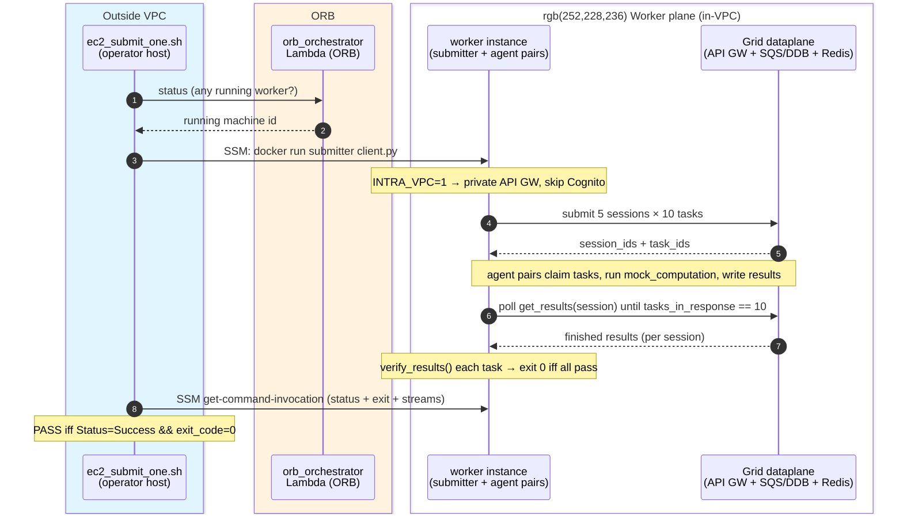
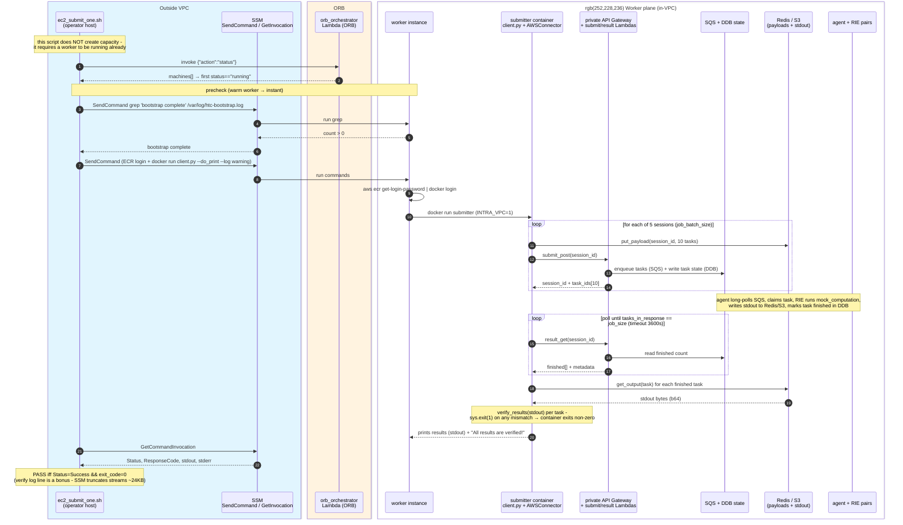

# HTC-Grid EC2 Backend - Sample Task Submission Sequence

The path a sample workload takes on the `worker_backend = "ec2"` grid: a host outside
the VPC orchestrates `ec2_submit_one.sh`, which runs the submitter image **on an
in-VPC worker** (via SSM) so it can reach the private API Gateway and Redis. The
client submits N sessions of tasks, the worker pairs execute them, and the client
polls for results and verifies each one. This is the dataplane companion to the
scaling loop in `ec2-scaling-up-sequence.md`.

## High-level (the core flow)

The essential round-trip: pick a worker, submit sessions, workers run tasks, poll
until every result is back and verified.

## Detailed

Same flow with the bootstrap precheck, ECR login, the submit/result dataplane split
(payload via Redis/S3, control via private API Gateway), and the operator-side
verification.

## Notes

- **Runs from inside the VPC.** A host outside the grid VPC cannot reach the private
  API Gateway or ElastiCache Redis, so the script does not submit directly. It uses SSM
  `RunShellScript` to run the submitter image **on an already-running worker** (in-VPC)
  and only orchestrates from outside. Required operator creds: `lambda:InvokeFunction`
  (status only), `ssm:SendCommand` + `GetCommandInvocation`, `ec2:DescribeInstances`.
- **`INTRA_VPC=1` changes two things** (`connector.py`). It points the client at the
  **private** API Gateway and **skips Cognito** authentication - so the only "login"
  needed is the ECR `docker login` the script runs on the worker before `docker run`
  (the submitter image is private). The worker's instance profile already grants ECR
  pull, matching what the bootstrap user-data does at boot.
- **Sample job shape (defaults).** `NUM_TASKS=1`, `JOB_SIZE=10`, `JOB_BATCH_SIZE=5`,
  `nthreads=1` → `job_size × njobs × job_batch_size = 50` tasks across **5 sessions of
  10 tasks each**. A session gets one `session_id` and is complete only when all its
  tasks finish; task ids are `<session_id>_0 … _9`. Override via env (e.g.
  `JOB_SIZE`, `JOB_BATCH_SIZE`, `WORKER_ARGS`).
- **Two-channel dataplane.** Control flows over the private API Gateway
  (`submit_post` / `result_get`); the task **payload and stdout** flow out-of-band via
  Redis/S3 (`task_input_passed_via_external_storage`). `get_results` polls
  `result_get` until `metadata.tasks_in_response == job_size`, then pulls each task's
  stdout from storage and base64-decodes it.
- **Bootstrap precheck is only meaningful for a freshly-launched worker.** ORB reports
  a machine `running` based on EC2 instance state, which flips true ~1–2 min before
  user-data finishes `docker compose up`. The `grep 'bootstrap complete'` step closes
  that window. For a warm worker (the normal case) it returns on the first poll and
  gates nothing. See `ec2-worker-bootstrap-sequence.md`.
- **Verification is exit-code authoritative.** `client.py` calls `sys.exit(1)` if
  `verify_results()` fails for any task, and `multiprocessing_execute_py` re-raises a
  non-zero child exit, so the container - and thus the SSM command - can only exit `0`
  if **every** task's result was retrieved and verified. The operator host therefore
  decides PASS/FAIL on `Status=Success && ResponseCode=0`; the
  `All results are verified!` log line is surfaced when present but not required
  (SSM truncates each output stream to ~24 KB, so the tail can be cut off).
- **No capacity management here.** This path assumes a worker is already running and
  errors out if none is; capacity is driven separately by the scaling loop
  (`ec2-scaling-up-sequence.md`) or manually (e.g. `orb_api_probe.sh RUN_CREATE=1`).
