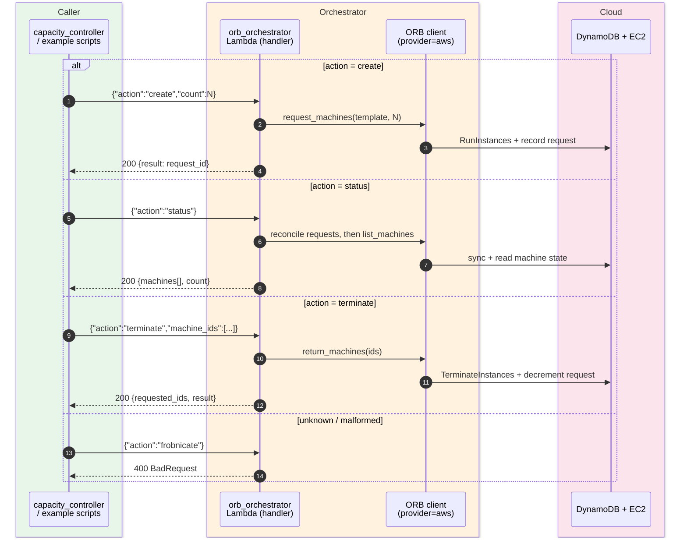
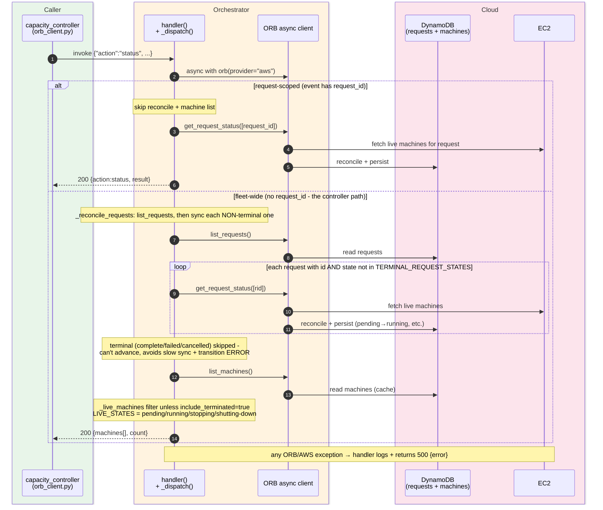

# HTC-Grid EC2 Backend - ORB Orchestrator Invocations

The `orb-orchestrator-${TAG}` Lambda is the single entry point the capacity controller (and the
example scripts) use to drive EC2 capacity through ORB. Every invocation carries an `action` -
one of `create`, `status`, or `terminate` - and the handler dispatches on it. The high-level
diagram shows all three actions; the detailed diagram zooms into the `status` path. It is the
actuator companion to the scaling-decision loop in `ec2-scaling-up-sequence.md`.

## High-level (the three actions)

One Lambda, three actions. `create` adds capacity, `status` reports live capacity (and refreshes
the read model first), `terminate` returns specific machines to ORB.

## Detailed - the `status` path

The two shapes of a `status` invocation: request-scoped (a `request_id` is passed → direct
`get_request_status`, no reconcile or machine list) and fleet-wide (the capacity controller's
path → reconcile non-terminal requests, then list and filter machines).

## Notes

- **One handler, three actions (`orb_lambda.py`).** `_dispatch` rejects anything outside
  `{create, status, terminate}` with a `BadRequest` → HTTP 400. `handler()` runs the async
  `_dispatch` via `asyncio.run`, tags logs with the action, and maps results to envelopes:
  success → `200 {body}`, `BadRequest` → `400 {error}` (warned, no stacktrace), any other
  exception → `500 {error}` (logged with stacktrace).
- **`create`.** `request_machines(template_id, count)` - `count` defaults to 1, `template_id`
  defaults to `EC2Fleet-Instant-OnDemand` (the ABIS template is rejected by orb-py's validator).
  For the EC2 Fleet templates (`TargetCapacityUnitType=vcpu`)
  `count` is a **vCPU target**, not an instance count: ORB sets `TotalTargetCapacity=count` and AWS
  packs a mix of instances until their vCPUs meet it. ORB records the request and launches instances;
  the call returns before instances exist (eventually consistent - the next `status` sees them).
- **`status` has two shapes.** With a `request_id`, it calls `get_request_status([id])` directly
  and returns - no reconcile, no machine list. Without one (the controller's path), it first runs
  `_reconcile_requests` then `list_machines`, filtering to live machines via `_live_machines`
  unless `include_terminated=true`.
- **Reconcile is a read-through sync, and skips terminal requests.** `list_machines()` reads
  DynamoDB (a cache); machine status only advances when ORB reconciles a request against live EC2.
  So before listing, `_reconcile_requests` enumerates requests and calls `get_request_status` on
  each - but **skips any request in `TERMINAL_REQUEST_STATES`** (complete/completed/failed/
  cancelled), since a terminal request can't change and syncing it just costs a slow round-trip
  and makes ORB log `Cannot transition request from failed to complete`. Reconcile is best-effort
  and never raises: a `list_requests` failure falls back to stored state, and a per-request sync
  failure is logged and skipped so one bad request can't break a tick.
- **`terminate` has two shapes, and a guarded kill-switch.** The normal path passes explicit
  `machine_ids` (the scale-down sweep does this once an instance is drained) → `return_machines`,
  which terminates the instances and decrements the owning request's desired count so ORB's
  bookkeeping doesn't drift. `terminate {"all": true}` is a fleet-wide kill that **bypasses
  graceful drain** and is gated off unless `ORB_ALLOW_TERMINATE_ALL=1`; it must not be the
  scale-down path. Terminate with neither → `BadRequest`.
- **Idempotent terminate.** Passing already-terminated ids is safe: `return_machines` /
  EC2 `TerminateInstances` are idempotent, and the next `status` reconciles the read model so the
  machines drop out of the live set. See the reconciliation discussion in the EC2 backend docs.
