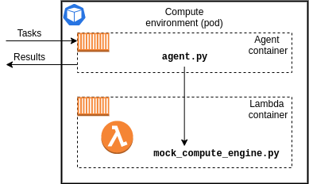

# Developing Python3 Worker Function

HTC-Grid comes with examples demonstrating how to build Python3, Java, and C++ based Worker functions.
The diagram below outlines the relationship between the Agent and the Worker function following Python3 example.



HTC-Grid's Worker function follows the same API as AWS Lambda function.
Following examples supplied with HTC-Grid (``examples/workloads/python/mock_computation/mock_compute_engine.py`` and ``examples/workloads/python/quant_lib/portfolio_pricing_engine.py``) and [AWS Lambda documentation](https://docs.aws.amazon.com/lambda/latest/dg/python-handler.html) write a python module that implements a lambda_handler entry point. This is the function that will be invoked when Agent passes the task to the Worker function.

Note, the entry python file and the handler function name can be re-defined in ``generated/python_runtime_grid_config.json`` (see below). To apply these changes, ``terraform apply`` needs to be re-executed under ``deployment/grid/terraform``

```JSON
"agent_configuration": {
    "lambda": {
       ...
      "lambda_handler_file_name" : "portfolio_pricing_engine",
      "lambda_handler_function_name" : "lambda_handler"
    }
  }
```


The ``lambda_handler`` has two arguments an ``event`` and a ``context``.
- ``event`` - is the task's definition that was provided by the client application at the time of the task submission.
- ``context`` -[To be defined]

The return of the ``lambda_handler`` function will be treated as the result of the task's execution and will be stored in the Data Plane by the Agent. Subsequently, the Client application will be able to retrieve this output from the Data Plane.

## Python3 Including Dependencies

HTC-Grid uses custom Lambda runtime [lambda-rie](https://github.com/aws/aws-lambda-runtime-interface-emulator) which closely mimics the runtime of AWS Lambda. Custom Lambda runtime (along with any additional dependencies) should be included into the docker image to execute the Worker function. See example below:

``` Dockerfile
# 1. Include custom lambda runtime
FROM public.ecr.aws/lambda/python:3.8
RUN yum install -d1 -y  zip

# 2. Create a directory which will hold all relevant dependencies e.g., [/app]
RUN mkdir -p /app
WORKDIR /app

# 3. Copy all relevant local dependencies
COPY portfolio_pricing_engine.py .
COPY american_options.py .
COPY european_options.py .
COPY ql_common.py .

# 4. Install any third party dependencies into the [/app] folder
RUN pip install --target=/app QuantLib

# 5. Zip the content of the [/app] which holds all the dependencies at this stage
RUN mkdir -p /app/build
RUN zip -yr lambda.zip .
ENTRYPOINT cp lambda.zip /app/build
```

The content of the produced zip file should be copied into an S3 bucket. The name of the bucket is stored in S3_LAMBDA_HTCGRID_BUCKET_NAME environmental variable which is set during the deployment stage of the HTC-Grid allowing the grid to retrieve and deploy the correct Worker function package at runtime.

For the complete examples please refer to one of the Makefiles in `examples/workloads` directory.
