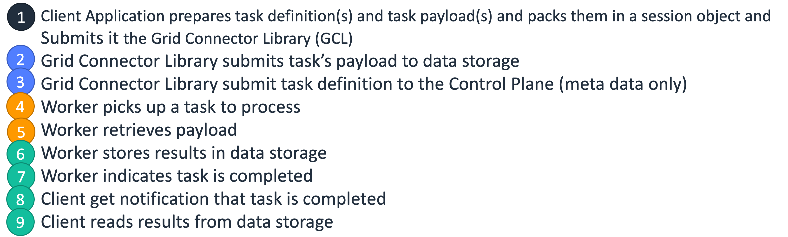

# HTC-Grid Architecture

This document outlines the high-level architecture and API of HTC-Grid, a container-based cloud-native HPC/Grid environment designed for high-throughput computing workloads.

## Design Tenets

HTC-Grid's design tenets have been shaped by the requirements of early adopters and recurring themes in Grid computing:

1. **Scale, High-Throughput**: Achieve provisioning capacity of >100,000s cores across multiple AWS regions to meet demanding FSI risk environments
2. **Low Latency**: Support sustained compute task throughput of >10,000 TPS with low infrastructure latency (~0.1s) for efficient short-duration tasks (~1s) without batching
3. **On-Demand**: Create dedicated services on-demand for overnight batch workloads or volatile intra-day workloads aligned to specific trading desks or individual power users
4. **Modular**: Composable, extensible architecture with interchangeable data-plane and compute-plane implementations through Infrastructure as Code
5. **Simplify Re-Platforming**: Support client APIs familiar to AWS customers
6. **All Compute Looks Like Lambda**: Tasks APIs are Lambda-compatible regardless of backend compute resource (Lambda Service, Container, or EC2)
7. **Cloud-Native**: Fully leverage operationally hardened AWS core services to optimize robustness and performance while minimizing operational management

## Definitions

* **Client Application** - A software system that generates job requests and retrieves computation results from the grid system.

* **Task** - A unit of work to be scheduled for execution. A task may have associated input and produce output. The interface follows AWS Lambda handler format ([Python](https://docs.aws.amazon.com/lambda/latest/dg/python-handler.html), [Go](https://docs.aws.amazon.com/lambda/latest/dg/golang-handler.html), [Java](https://docs.aws.amazon.com/lambda/latest/dg/java-handler.html), [C#](https://docs.aws.amazon.com/lambda/latest/dg/csharp-handler.html), etc).

* **Session** - A vector of tasks. For example, a job may define scenarios subdivided into tasks, submitted as a single session containing multiple tasks.

* **Task Input** - Data required in addition to the job definition, passed to Engines by reference, bypassing the scheduler.

* **The Engine** - Software component responsible for invoking task execution.

## High Level Architecture

HTC-Grid focuses on cloud-native serverless and fully managed services, performance & scalability, availability, cost optimization, and operational simplicity.

The grid system comprises 4 functional components:

1. **HTC-Grid Connector Library**: Language-specific API providing entry point for Client Applications
2. **Data Plane**: Configurable storage channel for job definitions, payload, and computational results
3. **Control Plane**: Scheduler equivalent - tracks task execution, grid scaling, and error handling  
4. **Compute Plane**: Pool of Computing Resources performing computational tasks

!!! note "Compute Plane Implementation"
    Currently, HTC-Grid Compute Plane provides only EKS implementation. The HTC-Agent is designed to support migration to other compute planes.

Each component operates within clearly defined roles. Inter-module communication uses standardized AWS APIs, facilitating independent development and customization options.

Internally, all 4 components use exclusively cloud-native building blocks: serverless functions and fully managed services requiring no human maintenance, highly available by design, and horizontally scalable.

## API: Interacting with HTC-Grid

The following diagram demonstrates high-level steps for task submission and result retrieval:

HTC-Grid allows client applications to submit sessions containing single tasks or task vectors. Each submission generates a system-wide unique session_id returned to the client. Successful session_id reception indicates all session tasks are in the system and will eventually execute.

Client applications use session_id to:
- Inquire task states (pending, running, failed, completed, etc.)
- Retrieve results once session tasks complete
- Monitor session progress and performance

A session completes when all tasks complete. Sessions failing to complete within specified timeout are considered failed.

## Detailed Component Architecture

### Control Plane

The Control Plane acts as the system scheduler, managing:

**Task Lifecycle Management:**
- Task state transitions (submitted → queued → running → completed/failed)
- Task retry logic and failure handling
- Session management and coordination

**Scaling Decisions:**
- Monitor queue depth and processing capacity
- Trigger compute resource scaling events
- Optimize resource allocation based on workload patterns

**State Management:**
- Persistent task and session state storage
- Audit trails and execution history
- Performance metrics collection

### Data Plane

The Data Plane provides configurable storage and I/O operations:

**Storage Options:**
- S3 for large payload and result storage
- DynamoDB for task metadata and state
- SQS for task queuing and messaging
- Custom storage adapters for specific workload needs

**Data Flow Management:**
- Input data staging and validation
- Result collection and aggregation
- Data lifecycle management
- Security and access control

### Compute Plane

The Compute Plane provides scalable task execution:

**EKS-Based Implementation:**
- Kubernetes pods running HTC-Agent containers
- Lambda-compatible runtime environment
- Horizontal pod autoscaling based on queue depth
- Multi-AZ deployment for high availability

**Task Execution:**
- Lambda-compatible task interface
- Isolated execution environments
- Resource allocation and monitoring
- Result capture and reporting

## Task Lifecycle and State Management

### Task State Transitions

Tasks progress through defined states with automatic transitions:

**State Descriptions:**
- **SUBMITTED**: Task received by the system
- **QUEUED**: Task placed in execution queue
- **RUNNING**: Task actively executing
- **COMPLETED**: Task finished successfully
- **FAILED**: Task execution failed
- **RETRY**: Task marked for retry after failure
- **CANCELLED**: Task cancelled by user or system

### Failure Detection and Recovery

HTC-Grid implements comprehensive failure handling:

**Detection Mechanisms:**
- Task timeout monitoring
- Health check failures
- Resource constraint detection
- Network connectivity issues

**Recovery Strategies:**
- Automatic task retry with exponential backoff
- Dead letter queue for persistent failures
- Resource reallocation and scaling
- Circuit breaker patterns for cascading failures

## Scaling Architecture

### Dynamic Scaling

HTC-Grid implements multi-level scaling:

**Horizontal Scaling:**
- EKS cluster node scaling based on resource demand
- Pod scaling based on queue depth
- Cross-AZ load distribution

**Vertical Scaling:**
- Task-specific resource allocation
- Memory and CPU optimization per workload type
- Storage scaling for large datasets

### Scaling Triggers

**Scale-Up Events:**
- Queue depth exceeds thresholds
- Task processing latency increases
- Resource utilization reaches limits

**Scale-Down Events:**
- Queue depth decreases
- Idle resource detection
- Cost optimization triggers

## Security Architecture

### Multi-Layer Security

**Network Security:**
- VPC isolation with private subnets
- Security groups and NACLs
- TLS encryption for all communications

**Identity and Access:**
- IAM roles and policies for service authentication
- Task-level access controls
- Audit logging and compliance

**Data Protection:**
- Encryption at rest and in transit
- Secure key management with KMS
- Data isolation between tenants

## Performance Optimization

### Throughput Optimization

**Queue Management:**
- Multiple priority queues
- Batch processing capabilities
- Load balancing across compute resources

**Resource Efficiency:**
- Container image optimization
- Warm container pools
- Resource request right-sizing

**Network Optimization:**
- Regional deployment strategies
- CDN integration for large datasets
- Connection pooling and reuse

## Monitoring and Observability

### Built-in Monitoring

**CloudWatch Integration:**
- Custom metrics for task throughput
- Resource utilization monitoring
- Cost tracking and optimization

**Prometheus and Grafana:**
- Real-time performance dashboards
- Custom alerting rules
- Historical trend analysis

**Container Insights:**
- EKS cluster monitoring
- Pod-level resource tracking
- Application log aggregation

For detailed monitoring setup, see [Monitoring Guide](../user_guide/monitoring.md).

## Integration Patterns

### Client Integration

**SDK Support:**
- Python, Java, and Go client libraries
- REST API for language-agnostic access
- Batch submission utilities

**Workflow Integration:**
- Step Functions integration
- Event-driven architectures
- CI/CD pipeline integration

### External System Integration

**Data Sources:**
- S3 data lake integration
- Database connectivity
- Real-time streaming data

**Result Destinations:**
- Data warehouse integration
- Notification systems
- Downstream processing pipelines

This architecture enables HTC-Grid to handle diverse high-throughput computing workloads while maintaining operational simplicity and cost efficiency.
