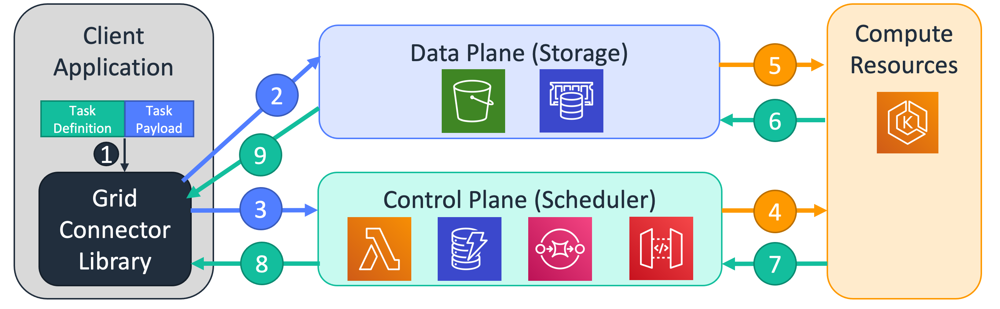

# HTC-Grid
The high throughput compute grid project (HTC-Grid) is a container based cloud native HPC/Grid environment. The project provides a reference architecture that can be used to build and adapt a modern High throughput compute solution using underlying AWS services, allowing users to submit high volumes of short and long running tasks and scaling environments dynamically.

**Warning**: This is an Open Source (Apache 2.0 License) project and NOT a supported AWS Service offering.

## When should I use HTC-Grid?
HTC-Grid should be used when the following criteria are met:

* High task throughput is required (from 250 to 10,000+ tasks per second)
* The tasks are loosely coupled
* Variable workloads (tasks with heterogeneous execution times) are expected and the solution needs to dynamically scale with the load

## When should I not use HTC-Grid?
HTC-Grid might not be the best choice if:

* The required task throughput is below 250 tasks per second: Use [AWS Batch](https://aws.amazon.com/batch/) instead
* The tasks are tightly coupled, or use MPI. Consider using either [AWS Parallel Cluster](https://aws.amazon.com/hpc/parallelcluster/) or [AWS Batch Multi-Node workloads](https://docs.aws.amazon.com/batch/latest/userguide/multi-node-parallel-jobs.html) instead
* The tasks use third party licensed software

## Getting Started

Choose your preferred learning path:

### Interactive Workshop
For hands-on learning with guided examples:
- **[Workshop Setup](./getting_started/workshop-setup.md)** - For AWS events or guided workshops
- **[Self-Paced Setup](./getting_started/self-paced-setup.md)** - For individual learning

### Quick Start
For experienced users who want to deploy immediately:
- **[Prerequisites](./getting_started/prerequisite.md)** - Setup requirements
- **[Happy Path Deployment](./getting_started/happy-path.md)** - Complete deployment guide

### Documentation
For comprehensive reference:
- **[Architecture Overview](./architecture/architecture.md)** - System design and components
- **[User Guide](./user_guide/creating_your_a_client.md)** - Client development and usage
- **[API Reference](./api/index.md)** - Developer documentation

## Key Features

### High Performance
- **10,000+ TPS**: Sustained task throughput capability
- **Low Latency**: ~0.1s infrastructure latency for short tasks
- **Massive Scale**: Support for 100,000+ cores across regions

### Cloud Native Design
- **Serverless Components**: Zero-administration building blocks
- **Auto Scaling**: Dynamic resource allocation based on demand
- **Multi-AZ**: High availability across availability zones

### Developer Friendly
- **Lambda Compatible**: Familiar AWS Lambda handler interface
- **Multiple Runtimes**: Python, Java, C++, and custom containers
- **Rich Monitoring**: CloudWatch, Prometheus, and Grafana integration

## Example Use Cases

### Financial Services
- **Risk Calculations**: Monte Carlo simulations for portfolio risk
- **Options Pricing**: High-frequency option pricing with QuantLib
- **Regulatory Reporting**: Parallel processing of compliance calculations

### Scientific Computing
- **Parameter Sweeps**: Large-scale parameter space exploration
- **Data Processing**: Parallel analysis of scientific datasets
- **Simulation Workloads**: Distributed simulation campaigns

### Media & Entertainment
- **Video Processing**: Parallel video encoding and transcoding
- **Image Analysis**: Batch image processing and ML inference
- **Content Generation**: Distributed rendering and content creation

## Architecture Highlights

HTC-Grid implements a modular, cloud-native architecture:

- **Control Plane**: Task scheduling and lifecycle management
- **Data Plane**: Configurable storage for inputs and results  
- **Compute Plane**: Scalable EKS-based task execution
- **Client Libraries**: Language-specific SDKs for easy integration

## Community and Support

### Getting Help
- **[Troubleshooting Guide](./user_guide/troubleshooting.md)** - Common issues and solutions
- **[GitHub Issues](https://github.com/finos/htc-grid/issues)** - Bug reports and feature requests
- **[Discussions](https://github.com/finos/htc-grid/discussions)** - Community Q&A

### Contributing
- **[Contributing Guide](../../CONTRIBUTING.md)** - How to contribute to the project
- **[Code of Conduct](../../CODE_OF_CONDUCT.md)** - Community guidelines
- **[Development Setup](./getting_started/self-paced-setup.md)** - Local development environment

## Cost Considerations

!!! warning "Cost Notice"
    HTC-Grid creates AWS resources that incur costs. Typical deployment costs approximately $50+ per day. Follow cleanup procedures when not in use.

**Cost Optimization Tips:**
- Use spot instances for compute nodes when possible
- Configure appropriate auto-scaling policies
- Monitor resource utilization and right-size components
- Clean up resources when not actively using the system

## Next Steps

1. **Start with the Workshop** - Follow the [Workshop Setup](./getting_started/workshop-setup.md) for guided learning
2. **Deploy HTC-Grid** - Use the [Happy Path](./getting_started/happy-path.md) for direct deployment
3. **Build Your First Client** - Follow the [User Guide](./user_guide/creating_your_a_client.md)
4. **Explore Examples** - Try the [Pricing Engine Example](./user_guide/pricing_engine_example.md)
5. **Monitor Performance** - Set up [Monitoring](./user_guide/monitoring.md)
