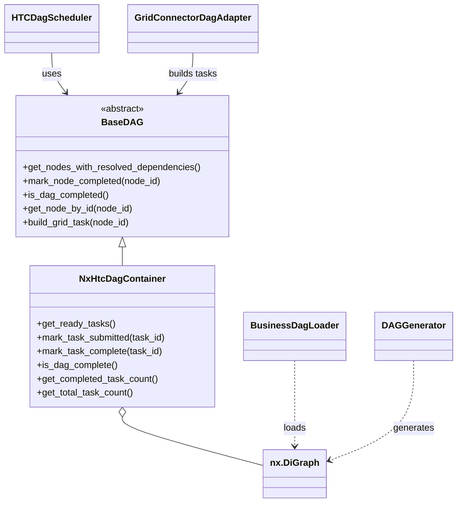

# DAG Client-side Architecture (DDD Overview)

This document provides the architectural context for the client-side DAG pipeline.
It is intended to be read before `DAG_client_side_implementation.md`, which dives into
the threaded adapter internals.

## Bounded context and language
The bounded context here is DAG execution on HTC Grid. The ubiquitous language is:
- DAG (aggregate) and DAG nodes (entities)
- dependency/precedence edges
- task status: pending, submitted, completed, failed
- ready tasks: nodes whose dependencies are completed
- task definition: payload sent to the grid connector

## Layered view (DDD + ports/adapters)

### Domain layer
- `BaseDAG` defines the core contract for readiness, completion, and task payload creation.
- `NxHtcDagContainer` is the NetworkX-backed aggregate that stores DAG structure and status.
- Domain rules include: acyclic graph, required node attributes, and state transitions.
- Task payloads are derived from node metadata (currently `worker_arguments`).

### Application layer
- `HTCDagScheduler` is the application service that drives the processing loop:
  ready -> submit -> poll -> complete.
- The CLI in `examples/client/python/dag_client.py` is the composition root:
  it loads config, builds the DAG, wires the scheduler and adapter, and runs.

### Infrastructure layer
- `GridConnectorDagAdapter` is the threaded adapter that talks to grid connectors.
- `GridConnectorFactory` creates per-thread connector instances from config.
- Grid connectors (`AWSConnector`, `MockGridConnector`) implement `send()` and `get_results()`.
- Input adapters (`BusinessDagLoader`, `DAGGenerator`) translate external data into a DAG.

## Ports and adapters mapping
- Port: `BaseDAG` (domain) -> Adapter: `NxHtcDagContainer` (NetworkX).
- Port: grid connector interface (`send` / `get_results`) -> Adapters: concrete connectors.
- `GridConnectorDagAdapter` bridges the scheduler (application) with connectors (infra).

## DAG class diagram

## Execution flow (high level)
1. Load or generate a DAG.
2. Wrap it in `NxHtcDagContainer` (domain aggregate).
3. Scheduler finds ready tasks and enqueues them to the adapter.
4. Adapter workers submit batches and poll results from connectors.
5. Scheduler marks completed nodes and repeats until the DAG completes.

## Current coupling notes
- `HTCDagScheduler` calls helpers on `NxHtcDagContainer` (for example,
  `get_ready_tasks`, `mark_task_complete`, `get_completed_task_count`), so
  alternative `BaseDAG` implementations must provide compatible methods or be wrapped.
- `BusinessDagLoader` sets default `task_type` and `worker_arguments` if missing,
  which matches the task definition shape used by the adapter.

## Extension points
- New DAG backend: implement `BaseDAG` for another graph library.
- New grid connector: implement the connector interface and wire it in the factory.
- New input format: add a loader that produces a NetworkX DAG or a `BaseDAG` implementation.

## Related documentation
- `docs/project/user_guide/DAG_client_side_implementation.md`
