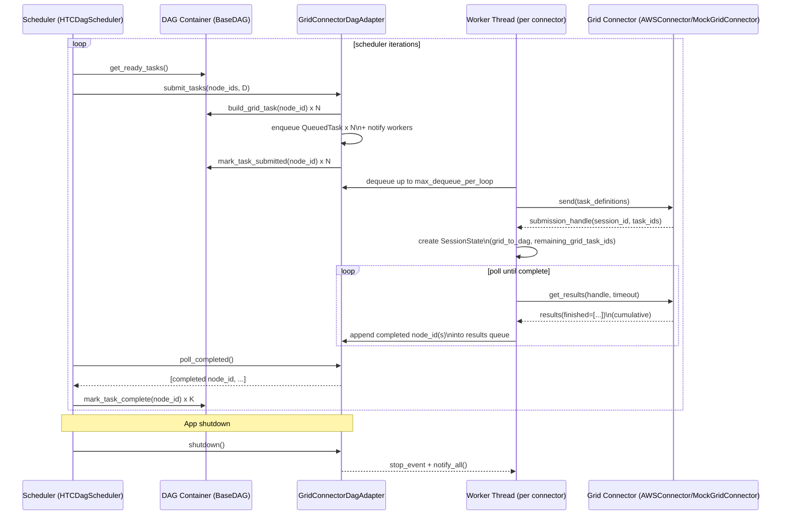

# Threaded Connector Adapter - Current Implementation

For the architectural overview (DDD and component boundaries), see
`docs/project/user_guide/DAG_client_side_architecture.md`.

## Summary
This document describes the current `GridConnectorDagAdapter` implementation: a threaded
adapter that keeps long-lived connectors, uses in-memory queues, and lets the scheduler
remain lightweight.

## What problem it solves
- Keeps a fixed set of worker threads and connectors alive for the lifetime of the adapter.
- Lets the scheduler thread do only two cheap operations: enqueue ready tasks and drain
  completed task IDs.
- Moves network latency in `send()` and `get_results()` off the scheduler thread.

## Where it fits
- The scheduler (`utils/dag/schedulers/htc_dag_scheduler.py`) calls:
  - `adapter.submit_tasks(ready_nodes, dag_container)`
  - `adapter.poll_completed()` and then `dag_container.mark_task_complete(node_id)`
- The adapter creates connectors via `utils/dag/grid_connector_factory.py`
  (one connector per worker thread).
- The DAG container (`NxHtcDagContainer`) builds task definitions and tracks status.

## Goals
- Start a configured number of threads when the adapter is initialized; threads persist
  until shutdown/destruction.
- Provide two thread-safe queues:
  - **Incoming tasks queue**: work items to be submitted to the grid.
  - **Completed results queue**: completed DAG task IDs ready to be consumed.
- Make `submit_tasks()` non-blocking and cheap: it should enqueue tasks (with locking).
- Make worker threads responsible for:
  - batching and submitting newly queued tasks to the grid
  - polling for completion of tasks previously submitted by that worker
  - pushing completed DAG IDs into the results queue
- Make `poll_completed()` non-blocking and cheap: it should drain/return items from
  the results queue.

## Non-goals
- Changing the scheduler loop semantics (`HTCDagScheduler`) beyond swapping adapter
  implementation.
- Changing connector APIs; the adapter must continue to use `send()` and `get_results()`
  as provided by the current connector implementations.
- Perfect delivery guarantees across process crashes (in-memory queues only).

## Public API (compatibility target)
The adapter is a drop-in replacement for the existing adapter used by the scheduler.

- `submit_tasks(node_ids: List[str], dag_container: BaseDAG) -> Dict[Any, Dict[str, str]]`
  - Enqueues work and returns quickly.
  - Return value can remain `{}` for compatibility (scheduler ignores it today).
- `poll_completed() -> List[Hashable]`
  - Drains completed DAG IDs from the results queue and returns them (possibly empty).
- `active_count() -> int`
  - Number of in-flight grid sessions across all workers (one session per `send()` call).
- `get_errors() -> List[WorkerError]`
  - Returns a snapshot of recent worker errors (bounded by `errors_maxlen`).
- `raise_if_failed() -> None`
  - Raises if a worker crashed or all workers stopped.
- `shutdown(wait: bool = True, timeout: Optional[float] = None) -> None`
  - Signals workers to stop and optionally joins them.
  - Prefer explicit shutdown over relying on `__del__`.

## Configuration
All keys are optional; defaults shown below.

- `num_connector_threads` (int, default `2`): number of long-lived worker threads/connectors.
  Must be > 0.
- `max_dequeue_per_loop` (int, default `100`): max number of queued tasks a worker will pick up
  and submit per loop iteration. Must be > 0.
- `poll_timeout_sec` (float, default `0.01`): passed to `connector.get_results(..., timeout_sec=...)`.
  Must be >= 0.
- `poll_interval_sec` (float, default `0.1`): wait/sleep interval when there is no immediate work;
  prevents busy looping. Must be >= 0.
- `retry_attempts` (int, default `3`): submission retry attempts. Must be > 0.
- `max_poll_failures` (int, default `3`): consecutive `get_results()` failures before remaining
  tasks are requeued. Must be > 0.
- `errors_maxlen` (int, default `1000`): max number of stored `WorkerError` entries. Must be >= 0.
- `use_mock_grid` (bool) and connector-specific settings for per-thread connector construction
  (via `GridConnectorFactory`).

## Core state and data model

### Incoming task queue (`self._tasks`)
- Type: `collections.deque[QueuedTask]`
- Producer: scheduler thread via `submit_tasks()`
- Consumers: worker threads via `_worker_main_loop()`

Each `QueuedTask` contains:
- `node_id`: DAG node ID
- `task_definition`: payload for `connector.send([...])`

### Completed results queue (`self._results`)
- Type: `collections.deque[Hashable]`
- Producer: worker threads (after polling finished tasks)
- Consumer: scheduler thread via `poll_completed()`

Items are DAG node IDs ready to be marked completed by the scheduler.

### De-duplication set (`self._queued_or_inflight`)
`submit_tasks()` deduplicates by keeping a set of node IDs that are either:
- currently queued, or
- in-flight on the grid (submitted but not yet returned via `poll_completed()`)

The set is cleared for a node only when `poll_completed()` drains that node from
`self._results`.

### Per-worker active sessions (`active_sessions`)
Each worker thread maintains its own dictionary:

- `active_sessions: Dict[str, SessionState]`

Each `SessionState` represents one grid submission (one `connector.send(...)` call):
- `session_id`: session identifier (from connector response, or a local fallback)
- `submission_handle`: full response object from `send()` (passed back to `get_results()`)
- `grid_to_dag`: maps grid task ID -> DAG node ID
- `remaining_grid_task_ids`: set of grid task IDs not yet emitted to the results queue
- `task_definitions_by_node`: stored task payloads, used for requeueing
- `poll_failures`: consecutive poll failures for this session

`remaining_grid_task_ids` is important because many connectors return cumulative `finished`
lists. Without this set, the same finished task could be emitted multiple times.

## Threading model

### Lifecycle
1. Adapter `__init__`:
   - Create shared queues (incoming + results).
   - Create locks/conditions.
   - Create a stop signal (`threading.Event`).
   - Start `num_connector_threads` threads; each thread creates/authenticates its own
     connector instance and enters the worker loop.
2. Adapter `shutdown()`:
   - Set stop event.
   - Notify any waiting workers.
   - Join threads (optional).

### Shared synchronization
The current implementation uses `collections.deque` with explicit `threading.Condition`
objects so that:
- `submit_tasks()` can enqueue multiple items and notify workers once.
- workers can atomically dequeue up to `max_dequeue_per_loop` items.

## Worker loop (required behavior)
Each worker thread runs a loop until shutdown:

1. **Pick up tasks**: dequeue up to `max_dequeue_per_loop` tasks from the incoming tasks queue.
2. **Submit new tasks**:
   - Submit the dequeued tasks as a single `connector.send(task_definitions)` call.
   - Extract `session_id` + `task_ids` (if present) to build `grid_to_dag` mapping.
   - Store `SessionState` in the worker's `active_sessions`.
   - Apply retry logic (`retry_attempts`); on final failure, requeue tasks.
3. **Poll for completions** (only sessions submitted by this worker):
   - Iterate the worker's `active_sessions`.
   - Call `connector.get_results(submission_handle, timeout_sec=poll_timeout_sec)`.
   - Extract finished grid task IDs.
   - Map finished grid IDs to DAG IDs and push them into the completed results queue.
   - Remove completed grid IDs from `remaining_grid_task_ids`.
   - When a session has no remaining grid tasks, remove it from `active_sessions`.
   - If `get_results()` fails repeatedly (`max_poll_failures`), requeue remaining tasks
     and drop the session.
4. **Idle control**:
   - If there were no new tasks and there are no active sessions, wait on a condition
     variable for new work (with a timeout).
   - If there are active sessions but no new tasks, sleep `poll_interval_sec` between
     polls to avoid busy spinning.

### Pseudocode
```python
def worker_main(thread_id: int) -> None:
    connector = create_and_authenticate_connector(thread_id)
    active_sessions: dict[str, SessionState] = {}

    while not stop_event.is_set():
        new_items = dequeue_up_to(max_dequeue_per_loop)

        if new_items:
            for attempt in range(retry_attempts):
                try:
                    handle = connector.send([i.task_definition for i in new_items])
                    session = build_session_state(handle, new_items)
                    active_sessions[session.session_id] = session
                    break
                except Exception:
                    if attempt == retry_attempts - 1:
                        record_error(thread_id, new_items)
                        requeue_items(new_items)
                    else:
                        sleep(1.0)

        for session_id, session in list(active_sessions.items()):
            try:
                results = connector.get_results(session.submission_handle, timeout_sec=poll_timeout_sec)
                session.poll_failures = 0
            except Exception:
                session.poll_failures += 1
                if session.poll_failures >= max_poll_failures:
                    requeue_remaining(session)
                    del active_sessions[session_id]
                continue
            finished = extract_finished(results)
            for grid_task_id in finished:
                node_id = session.grid_to_dag.get(grid_task_id)
                if node_id is not None and grid_task_id in session.remaining_grid_task_ids:
                    session.remaining_grid_task_ids.remove(grid_task_id)
                    results_queue_push(node_id)
            if not session.remaining_grid_task_ids:
                del active_sessions[session_id]

        if not new_items and not active_sessions:
            wait_for_work_or_timeout(poll_interval_sec)
        elif active_sessions and poll_interval_sec:
            sleep(poll_interval_sec)
```

## `submit_tasks()` behavior
`submit_tasks()` should:
- Deduplicate: do not enqueue the same DAG task ID more than once.
- Update DAG status early enough to prevent re-queuing by the scheduler on subsequent
  iterations.
- Recommended: call `dag_container.mark_task_submitted(node_id)` in `submit_tasks()`
  (single-threaded from scheduler).
- Build `task_definition` (recommended) and enqueue items under a lock.
- Notify a condition variable to wake sleeping workers.
- Note: `poll_completed()` removes completed node IDs from the de-dup set.

Notes:
- If the DAG container is not thread-safe for status updates, keep all DAG status
  transitions on the scheduler thread.
- Queues are unbounded: `submit_tasks()` enqueues all deduped tasks and workers push
  all completed results until they are drained via `poll_completed()`.

## `poll_completed()` behavior
`poll_completed()` should:
- Acquire the results queue lock.
- Drain all currently available completed DAG IDs (or up to a configured max) and return
  them.
- Return quickly; do not call the grid connector from `poll_completed()`.
- Clear the de-dup guard for returned node IDs.

## Error handling and observability
Background threads can fail; the implementation surfaces failures via:

- A thread-safe, bounded `errors` deque (`errors_maxlen`) storing `WorkerError` records.
- Logging with thread id and stage for `send`, `get_results`, and other exceptions.
- `raise_if_failed()` raising when a worker crashes (`worker_crash`) or when all workers
  stop.
- `send()` failures are retried; when retries are exhausted, tasks are requeued.
- `get_results()` failures are tracked per session; after `max_poll_failures`, remaining
  tasks are requeued.

## Sequence diagram (submit -> run -> poll -> complete)



## Metrics (not implemented)
Metrics are not tracked in the current adapter. If needed, consider adding:
- Queue sizes: incoming depth, results depth.
- Submission metrics: total tasks enqueued/submitted, retries, failures.
- Poll metrics: poll duration, finished tasks per poll.
- Active session count per worker and total.

## Integration notes (with `HTCDagScheduler`)
- Scheduler loop remains the same:
  - `submit_tasks(ready_nodes, dag_container)` becomes an enqueue operation.
  - `poll_completed()` becomes a drain of completed IDs produced by workers.
- Ensure tasks are marked `submitted` before they can appear as ready again.

## Testing strategy (recommended)
- Unit tests with a deterministic mock connector:
  - enqueue tasks, verify workers submit in batches
  - simulate results and verify `poll_completed()` returns expected DAG IDs
  - verify dedupe behavior in `submit_tasks()`
  - verify `shutdown()` terminates threads promptly
- Concurrency tests:
  - multiple `submit_tasks()` calls while polling is active
  - high-throughput enqueue + completion drain without deadlocks
