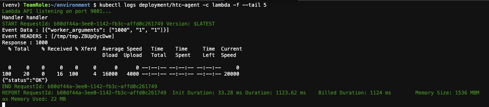
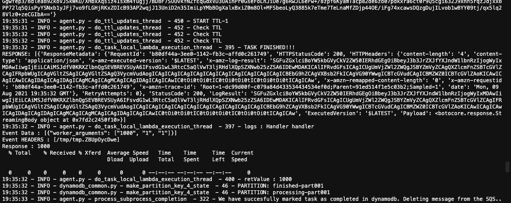

# Creating Your HTC-Grid Client

This guide shows how to configure a client application and submit tasks to HTC-Grid. We assume you have successfully deployed HTC-Grid and have at least one pod running.

## Client Setup Options

### Option 1: VSCode Server Instance (Recommended)

1. **Create VSCode Server Environment:**
   - Deploy using the workshop CloudFormation template
   - Get VSCodeURL and password from stack outputs  
   - Access via browser

2. **Setup Repository:**
   ```bash
   git clone https://github.com/finos/htc-grid.git
   cd htc-grid
   ```

3. **Configure Agent Settings:**
   ```bash
   # Copy agent config from deployment
   export AGENT_CONFIG_FILE=/path/to/agent_config.json
   export INTRA_VPC=1  # For same-VPC clients (no Cognito auth needed)
   ```

### Option 2: External Client

For clients outside the VPC, additional Cognito authentication is required.

## Build Client Packages

```bash
# Build required packages
make packages

# Verify packages created
ls ./dist/
# Should show: api-0.1-py3-none-any.whl utils-0.1-py3-none-any.whl
```

## Install Client Dependencies

```bash
cd ./examples/client/python/
pip3 install -r requirements.txt
```

## Submit Your First Task

### Monitor Components (Optional)

Open multiple terminals to monitor HTC-Grid components:

**Terminal 1 - HTC-Agent logs:**
```bash
kubectl logs deployment/htc-agent -c agent -f --tail 5
```

**Terminal 2 - Lambda container logs:**
```bash
kubectl logs deployment/htc-agent -c lambda -f --tail 5
```

### Submit Single Task

Use the pre-built Kubernetes job for testing:

```bash
cd ~/environment/htc-grid
kubectl apply -f ~/environment/htc-grid/generated/single-task-test.yaml
```

Monitor the job execution:
```bash
kubectl logs job/single-task -f
```

!!! note "Container Startup"
    If you get "ContainerCreating" errors, wait a few seconds and retry the logs command.

### Expected Output

**Lambda Container Output:**


**HTC-Agent Output:**


### Verify in DynamoDB

1. Go to AWS Console → DynamoDB
2. Select table `htc_tasks_state_table-<TAG>`
3. Click "Explore Table Items"
4. View your task execution details


### Clean Up Test Job

```bash
kubectl delete -f ~/environment/htc-grid/generated/single-task-test.yaml
```

## Using the Python Client

### Basic Client Usage

```python
from htc_grid_client import HTCGridClient
import json

# Initialize client
client = HTCGridClient(config_file='agent_config.json')

# Define a simple task
task = {
    'runtime': 'python',
    'payload': {
        'function': 'lambda x: x * 2',
        'input': 42
    }
}

# Submit single task
session_id = client.submit_session([task])
print(f"Session ID: {session_id}")

# Wait for completion
results = client.get_session_results(session_id)
print(f"Result: {results[0]}")
```

### Submit Multiple Tasks

```python
# Create multiple tasks
tasks = []
for i in range(10):
    task = {
        'runtime': 'python',
        'payload': {
            'task_id': i,
            'computation': f'fibonacci({i})'
        }
    }
    tasks.append(task)

# Submit session
session_id = client.submit_session(tasks)

# Monitor progress
import time
while True:
    status = client.get_session_status(session_id)
    completed = status['completed_tasks']
    total = status['total_tasks']
    
    print(f"Progress: {completed}/{total}")
    
    if completed == total:
        break
    
    time.sleep(2)

# Get all results
results = client.get_session_results(session_id)
for i, result in enumerate(results):
    print(f"Task {i}: {result}")
```

### Advanced Client Features

**Session Management:**
```python
# Get session status
status = client.get_session_status(session_id)

# Cancel session
client.cancel_session(session_id)

# List active sessions
sessions = client.list_sessions()
```

**Task Configuration:**
```python
task = {
    'runtime': 'python',
    'payload': {...},
    'timeout': 300,  # 5 minutes
    'memory': 1024,  # MB
    'retry_count': 3,
    'priority': 'high'
}
```

## Client Configuration

### Agent Config File

The `agent_config.json` contains connection details:

```json
{
    "api_gateway_url": "https://api-id.execute-api.region.amazonaws.com/prod",
    "cognito_user_pool_id": "region_poolid",
    "cognito_client_id": "client_id",
    "region": "us-east-1"
}
```

### Environment Variables

```bash
export AGENT_CONFIG_FILE=/path/to/agent_config.json
export INTRA_VPC=1  # Skip Cognito auth for same-VPC clients
export HTC_LOG_LEVEL=INFO
```

## Error Handling

### Common Issues

**Connection Errors:**
```python
try:
    session_id = client.submit_session(tasks)
except ConnectionError as e:
    print(f"Connection failed: {e}")
    # Check network connectivity and config
```

**Task Failures:**
```python
results = client.get_session_results(session_id)
for i, result in enumerate(results):
    if result.get('statusCode') != 200:
        print(f"Task {i} failed: {result.get('error')}")
```

**Timeout Handling:**
```python
import signal

def timeout_handler(signum, frame):
    raise TimeoutError("Session timeout")

signal.signal(signal.SIGALRM, timeout_handler)
signal.alarm(300)  # 5 minute timeout

try:
    results = client.get_session_results(session_id)
finally:
    signal.alarm(0)
```

## Performance Optimization

### Batch Submission

```python
# Submit large batches efficiently
batch_size = 100
for i in range(0, len(all_tasks), batch_size):
    batch = all_tasks[i:i + batch_size]
    session_id = client.submit_session(batch)
    session_ids.append(session_id)
```

### Async Processing

```python
import asyncio
from concurrent.futures import ThreadPoolExecutor

async def process_sessions(session_ids):
    with ThreadPoolExecutor(max_workers=10) as executor:
        loop = asyncio.get_event_loop()
        futures = [
            loop.run_in_executor(executor, client.get_session_results, sid)
            for sid in session_ids
        ]
        results = await asyncio.gather(*futures)
    return results
```

## Next Steps

- [Monitor your tasks](./monitoring.md)
- [Try the pricing engine example](./pricing_engine_example.md)
- [Configure priority queues](./configuring_priority_queues.md)
- [Troubleshoot issues](./troubleshooting.md)

    To show the example client application help

    ```bash
    python3 ./client.py --help
    ```

    To submits a single session (containing a single task by default)

    ```bash
    python3 ./client.py  --njobs 1
    ```

    To submits 2 batches of 4 sessions each, where each session contains 3 tasks. Total 4*3*2 24 tasks.

    ```bash
    python3 ./client.py  --njobs 2 --job_size 3 --job_batch_size 4
    ```
    To tarts 5 threads, each submits a single session with 1 job with a custom arguments to the executable.

    ```bash
    python3 ./client.py  --njobs 1 --worker_arguments "5000 1 100" -nthreads 5
    ```


